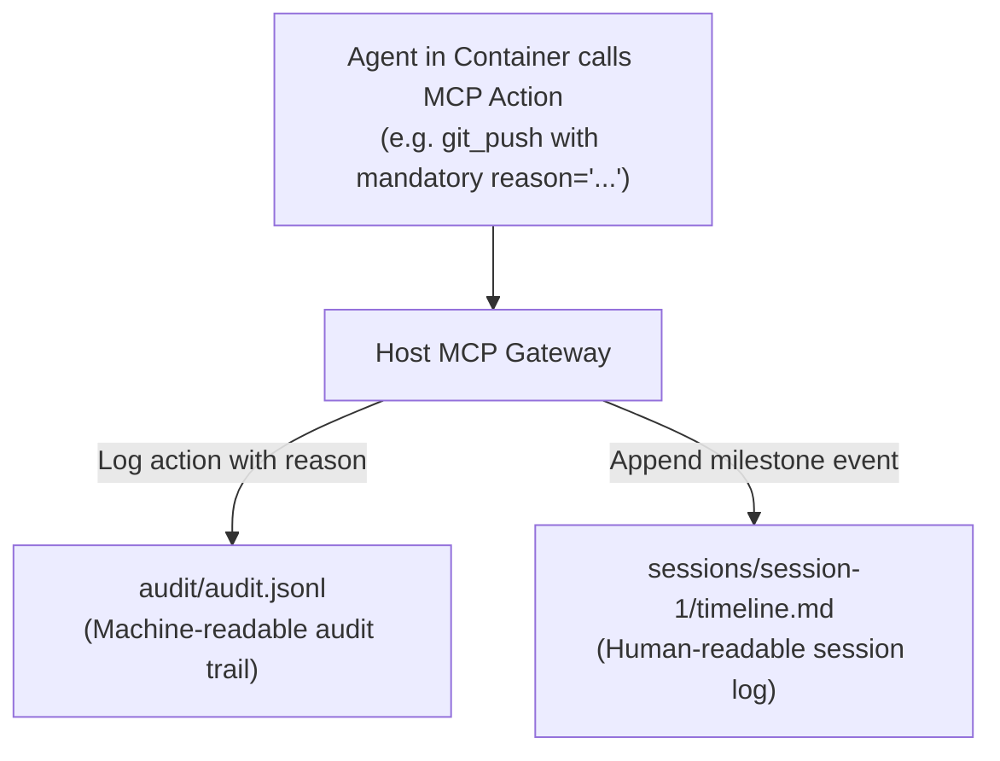
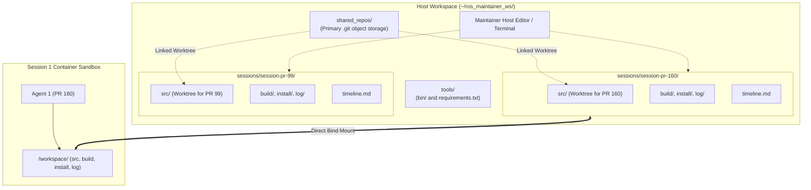
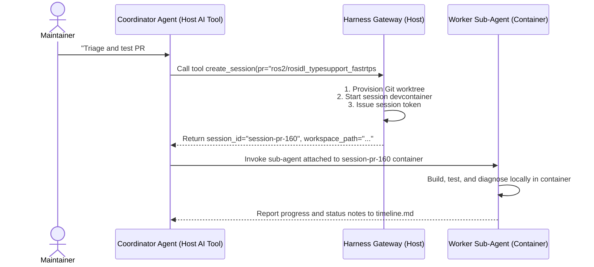

# Architecture & Design Plan: `ros-maintainer-agent-harness`

## 1. Vision & Purpose

When maintaining ROS 2 repositories with the assistance of an AI coding agent, the goal is to enable the agent to work autonomously on local tasks (compiling code, executing test suites, fixing bugs, refactoring, and diagnosing CI failures) while providing practical guardrails to help avoid accidental or unvetted remote side-effects.

### How it Works
1. **Containerized Execution Sandbox**: The agent runs entirely inside a container (such as a standard ROS 2 devcontainer), isolated from the maintainer's host system credentials and SSH keys. The base ROS 2 distribution (e.g. Rolling desktop) is provided directly by the container environment under `/opt/ros/<distro>`.
2. **Read-Only Container Access**: The container is only provided a read-only GitHub token, allowing it to fetch code, pull branches, and read issue/PR discussions, but preventing it from directly pushing code or creating comments.
3. **Host-Side Policy Gateway (MCP Server)**: A lightweight service running on the maintainer's host machine exposes a controlled set of tools via the Model Context Protocol (MCP). This service holds the maintainer's write credentials and enforces rules regarding what actions the agent can perform, when it can perform them, and what requires explicit maintainer approval.

---

## 2. Maintainer Workspace Layout & File Locations

All shared configuration, repositories, tools, session workspaces, and audit logs live under a single unified workspace on the host (e.g. `~/ros_maintainer_ws/`):

```
~/ros_maintainer_ws/
├── config/                     # Configuration and maintainer preferences
│   ├── policy.yaml             # Enforced push/CI policies
│   └── maintainer_rules.md     # Human-readable maintainer conventions & preferences
│
├── tools/                      # Shared helper scripts & utilities (available across ALL sessions)
│   ├── bin/                    # Executable scripts (mounted into $PATH for all containers)
│   ├── README.md               # Tool catalog describing what each script does and how to use it
│   └── requirements.txt        # Shared Python dependencies for tools (installed inside each container)
│
├── shared_repos/               # Central primary Git clones (central .git object database)
│   ├── ros2/                   # e.g. rclcpp.git, rmw_implementation.git
│   └── ros-tooling/            # e.g. ros-github-scripts.git
│
├── sessions/                   # Isolated active task workspaces (one per conversation/PR)
│   ├── session-pr-160/         # Conversation 1
│   │   ├── src/                # Linked git worktrees pointing to shared_repos/
│   │   ├── build/              # Dedicated colcon build directory (bind-mounted to host)
│   │   ├── install/            # Dedicated colcon install directory (bind-mounted to host)
│   │   ├── log/                # Dedicated test and build logs (bind-mounted to host)
│   │   ├── scratch/            # Temporary session-specific scripts and notes
│   │   └── timeline.md         # Chronological session narrative & status updates
│   │
│   └── session-pr-99/          # Conversation 2
│       ├── ...
│       └── timeline.md
│
└── audit/                      # Central gateway action logs
    └── audit.jsonl             # Structured machine-readable audit trail of all remote actions
```

---

## 3. Shared Tooling & Python Dependency Management

### Why not share a Python `venv` between containers?
Sharing a single pre-built `venv/` directory across containers or between host and containers is brittle and unsafe:
* **Binary & ABI Incompatibilities**: Differing Python patch versions, glibc versions, or host vs. container architectures break binary C-extensions and compiled wheels.
* **Concurrent Modification Races**: Multiple containers attempting to `pip install` packages into the same directory cause file corruption.
* **Absolute Path Breakage**: Python virtualenvs embed hardcoded absolute paths to interpreters and site-packages.

### The Solution: Shared `requirements.txt` + Container-Local Environments
1. **Shared Specification (`tools/requirements.txt`)**:
   * Shared Python dependencies (such as `PyGithub`, `requests`, `jenkinsapi`) are defined declaratively in `~/ros_maintainer_ws/tools/requirements.txt`.
2. **Container-Local Installation**:
   * Each devcontainer creates and manages its own isolated environment (e.g. in `/root/.venv` or system site-packages) upon container initialization (`postCreateCommand: pip install -r /workspace/tools/requirements.txt`).
3. **Shared Executables (`tools/bin/`)**:
   * Custom scripts placed in `tools/bin/` (e.g., `ros-find-restarted-ci`) use a standard `#!/usr/bin/env python3` shebang, allowing them to run seamlessly inside any container using that container's local Python runtime.
4. **Tool Catalog (`tools/README.md`)**:
   * Describes each tool's purpose and usage so agents automatically discover available utilities on startup.

---

## 4. Audit Logging & Session Status Service

For long-running autonomous workflows (e.g. monitoring CI, diagnosing flaky tests, applying fixes across multiple platforms), maintainers need clear visibility into what actions were taken and why.



### A. Structured Action Audit Log (`audit/audit.jsonl`)
Every action invoked through the MCP gateway records a structured JSON record including a mandatory **`reason`** parameter provided by the agent:

```json
{
  "timestamp": "2026-08-20T22:08:43Z",
  "session_id": "session-pr-160",
  "action": "git_push",
  "status": "APPROVED",
  "target": "wjwwood/rosidl_typesupport_fastrtps:wjwwood/enforce_cppcheck_lyrical",
  "reason": "Cherry-picked commit 77ab234 to resolve lyrical branch compiler warning",
  "details": {
    "commit_sha": "024696d",
    "force_with_lease": true
  }
}
```

### B. Human-Readable Session Narrative (`sessions/<id>/timeline.md`)
The gateway exposes a dedicated MCP tool: `log_status(message: str, milestone: Optional[str] = None)`.

Agents use this tool during long-running tasks to record periodic status notes. Maintainers can simply `cat` or open `timeline.md` in their host editor to catch up on what happened while they were away:

```markdown
# Session Timeline: PR #160 (rosidl_typesupport_fastrtps)

- **[22:05:12]** Initialized workspace on branch `wjwwood/enforce_cppcheck_lyrical`.
- **[22:08:43]** **Action (Push)**: Pushed commit `024696d` — *Cherry-picked commit 77ab234 to resolve lyrical compiler warning*.
- **[22:10:05]** **Action (CI)**: Launched Jenkins CI run `#20143` on `lyrical` desktop.
- **[22:45:20]** **Status**: Linux, Linux-aarch64, and Linux-rhel finished SUCCESS. Windows job 29019 disconnected due to runner node restart.
- **[22:48:10]** **Action (CI Comment)**: Discovered rescheduled Windows build `29041` (queued at position #1); updated GitHub PR comment in-place.
- **[23:15:30]** **Status**: All 4 platform jobs completed with SUCCESS. Ready for maintainer final review.
```

---

## 5. Policy Structure: Invariants vs. Configurable Settings

### Built-in Invariants
* **No Conversational Comments**: The harness provides no general comment posting tool—preventing accidental impersonation.
* **No Auto-Merging**: Merging pull requests is strictly reserved for maintainers.
* **No Direct Base Branch Pushes**: Pushes to `main`, `master`, `rolling`, `jazzy`, etc. are blocked at the gateway level.
* **No Unapproved PR/Issue Creation**: Opening PRs/issues requires explicit interactive maintainer approval.

### Configurable Maintainer Settings (`policy.yaml`)
* **Branch Push Rules**: Allowed branch regex patterns (e.g. `^wjwwood/.*$`).
* **External Fork Protection**: Require maintainer confirmation before pushing to 3rd-party contributor forks.
* **Repository Scope**: Allowlisted GitHub organizations and repositories.
* **Jenkins CI Controls**: Maximum concurrent runs per PR, cooldown intervals, and auto-cancellation of superseded builds.

---

## 6. Host-to-Container Code Sharing & Session Isolation

This section explains how files are shared between the host and container, and how parallel sessions operate concurrently without interference.



### Detailed Workflow Mechanics
1. **Full Workspace Visibility on Host**:
   * Every file created by the agent—including source code (`src/`), build targets (`build/`), generated headers and libraries (`install/`), compilation/test logs (`log/`), and status timelines (`timeline.md`)—is bind-mounted directly to the host session folder.
   * Maintainers can inspect compiler outputs, debug test failures, or make manual edits in their native host editor without entering the container.
2. **Git Worktree Storage Sharing**:
   * To prevent duplicate downloads and heavy disk usage from multiple copies of the ROS 2 repository tree, `shared_repos/` holds central git clones.
   * Each session uses `git worktree add` to create an independent working directory for its specific PR branch linked back to the central git objects.
3. **Session-Level Isolation**:
   * Each conversation runs in its own session directory with its own isolated `build/` and `install/` folders. This guarantees that parallel `colcon build` commands across multiple active agent sessions never collide or overwrite build artifacts.
4. **Local-Only Git Posture in Container**:
   * The container environment only possesses read-only GitHub credentials. The agent can run `git diff`, `git add`, and create local commits, but any remote push is routed through the host MCP gateway for policy validation.

---

## 7. Sub-Agent Architecture & MCP Server Execution

### A. Division of Responsibilities
To remain modular and agnostic to the developer's chosen AI tool (e.g. Antigravity, Claude Code, Cursor, VS Code):
* **AI Tool / Orchestrator**: Manages conversation state, context windows, user interaction, and sub-agent spawning.
* **Harness CLI / Host Gateway**: Manages the physical workspace (Git worktrees, container bind-mounts, session lifecycle, policy enforcement, and audit logs).

### B. Multi-Session Sub-Agent Lifecycle


### C. Where and How the MCP Server Runs
The MCP server runs on the maintainer's host machine. FastMCP supports both standard execution modes:
1. **Direct IDE / Tool Launch (`stdio` Mode)**:
   * Launched on-demand as a child process by the host tool (e.g., Antigravity, Cursor, Claude Desktop) via MCP configuration:
     ```json
     {
       "mcpServers": {
         "ros-maintainer-harness": {
           "command": "ros-maintainer-harness",
           "args": ["serve", "--workspace", "~/ros_maintainer_ws"]
         }
       }
     }
     ```
2. **Standing Background Service (`SSE / HTTP` Mode)**:
   * Run as a local daemon (`ros-maintainer-harness serve --transport sse --port 8765`), allowing multiple independent containers to connect to `http://host.docker.internal:8765/sse` via local token authentication.

---

## 8. Phased Implementation Roadmap

* **Phase 1: Workspace Layout, Worktrees & Tool Catalog**
  * Scaffold directory structure (`config/`, `tools/`, `shared_repos/`, `sessions/`, `audit/`).
  * Implement Git worktree session manager.
  * Setup `maintainer_rules.md`, `tools/README.md`, and `timeline.md` loggers.
* **Phase 2: Host FastMCP Gateway & Safety Rules**
  * Implement FastMCP server with policy validator (`policy.yaml`).
  * Add `reason` logging to all action tools and implement `log_status`.
  * Add branch push guards, CI rate-limiting, and interactive approval tickets.
  * Integrate `ros-ci-for-pr` and `ros-find-restarted-ci`.
* **Phase 3: Devcontainer Templates & Distribution**
  * Create standard `.devcontainer` configuration mounting workspace and tools.
  * Package as a clean CLI tool (`pip install ros-maintainer-agent-harness`).
